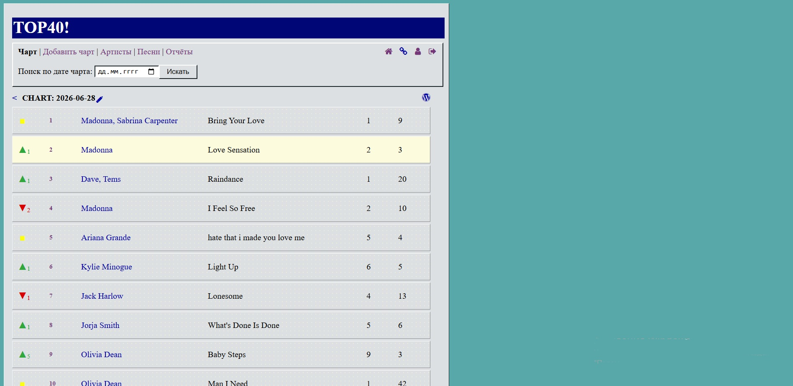
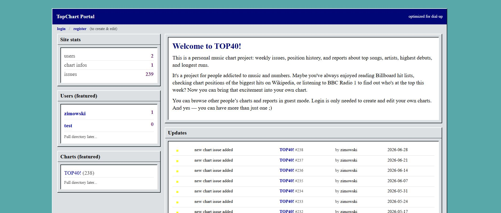
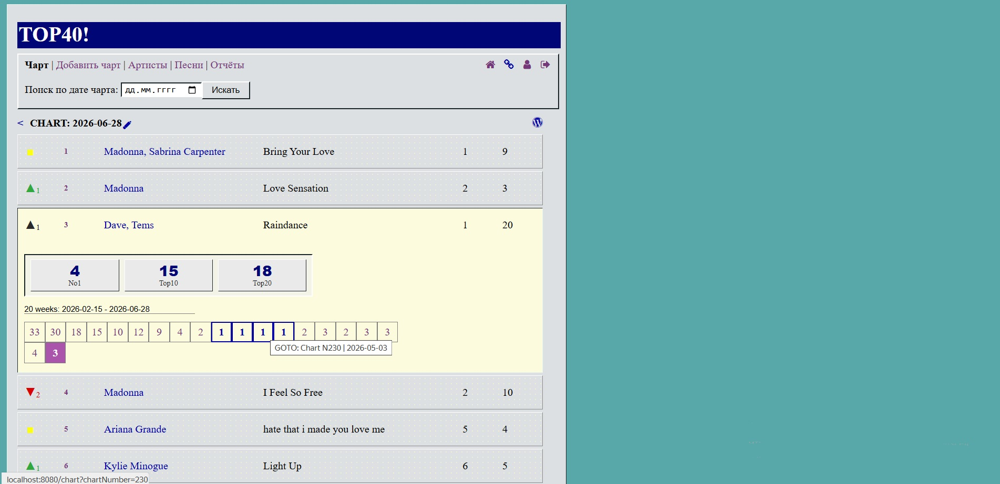
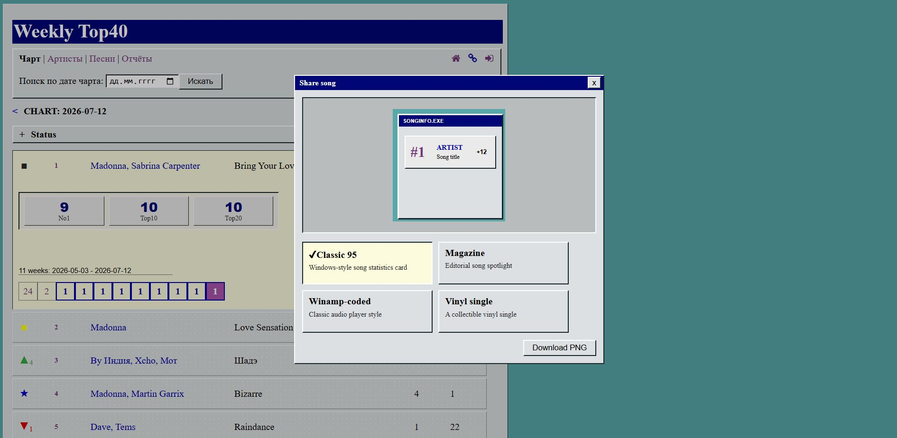
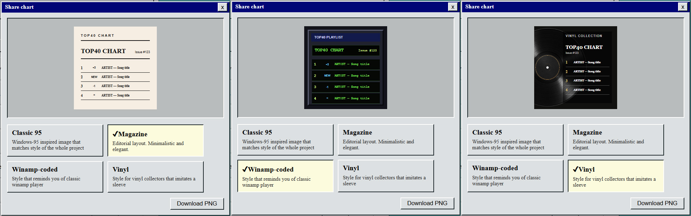
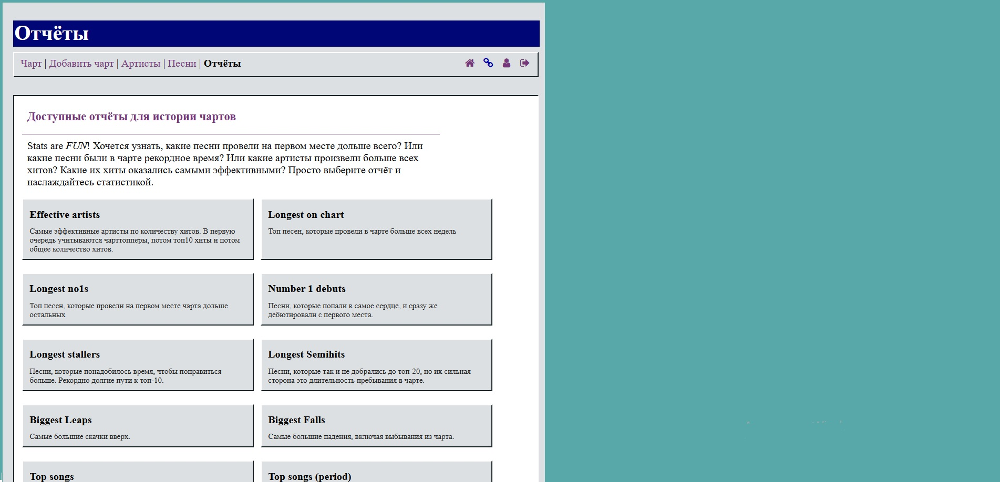
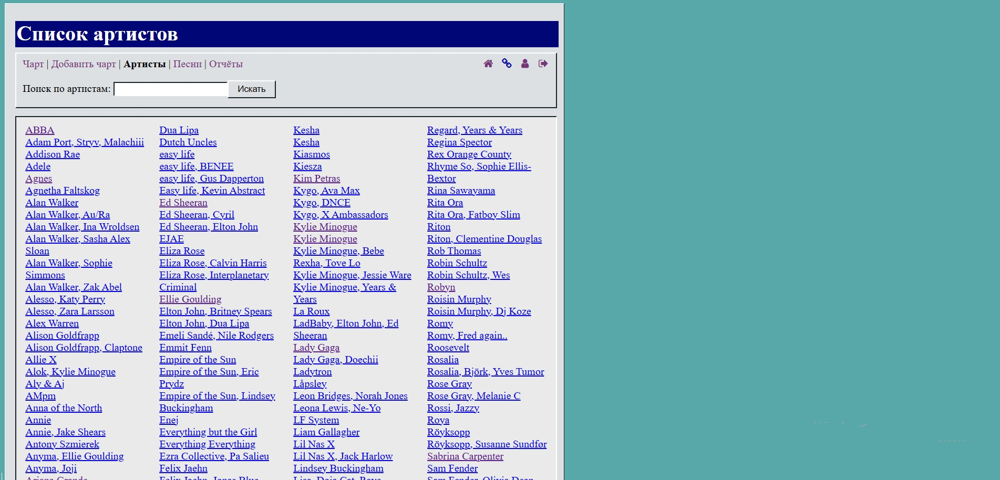
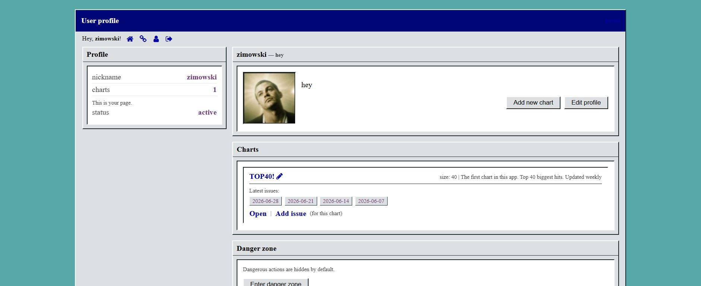
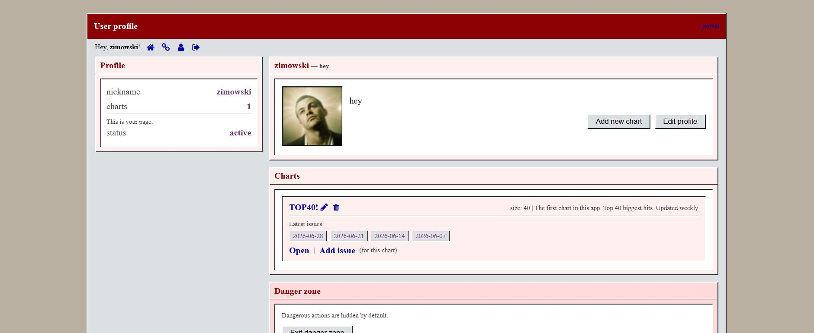

# TOP40 Chart Manager

TOP40 Chart Manager is a Java web application for creating, managing and analyzing personal music charts. Publish weekly chart editions, browse song histories, track artist statistics, generate analytical reports, and export PNG cards to share your charts with other music enthusiasts on social media.

---

## 🛠️ Tech Stack

- Java 8
- Java Servlet API 4.0.1
- JSP
- JSTL 1.2
- Hibernate 5.4.3
- MySQL 8 
- Gson 2.10.1
- Maven
- Apache Tomcat
- JavaScript
- jQuery



---

## 🚀 Features

- Create and manage multiple music charts
- Publish weekly chart editions
- Automatic calculation of:
  - Peak position
  - Weeks on chart
  - New entries
  - Re-entries
- Interactive chart editing
- Song history with complete chart run
- Artist pages with detailed statistics
- Song and artist search
- Built-in analytical reports
- User accounts with separate chart collections
- Export charts and song cards as stylized PNG images
- Retro Windows 95 inspired interface

---

## 💡 Main Functionality

### 📈 Weekly Charts

Create a new weekly chart based on the previous edition.

The application automatically detects:

- New entries
- Re-entries
- Position changes
- Peak positions
- Weeks on chart

### 🎵 Song Pages

Each song has its own history page containing:

- Peak position
- Weeks on chart
- First chart appearance
- Complete chart run
- Position movement history

### 🎤 Artist Pages

Every artist has a dedicated page showing:

- Number of No.1 hits
- Top 10 hits
- Top 40 hits
- Complete chart discography

### 📊 Reports

Generate detailed statistics including:

- Most effective artists
- Highest scoring artists
- Longest charting songs
- Longest-running No.1 songs
- Biggest jumps
- Biggest falls
- No.1 debuts
- Longest stallers
- Longest semi-hits
- Highest scoring songs
- Date-based reports

### 🖼️ Share Cards

Generate high-quality PNG images for sharing top10 or individual songs.

Four unique export styles are available:

- Classic95 — inspired by classic Windows 95 applications
- Magazine — clean editorial magazine layout
- Winamp — nostalgic late-90s media player design
- Vinyl — collectible vinyl single artwork

Charts and songs can be exported directly from the browser with a single click and then shared on your socials. 

---

## 📸 Screenshots

### Welcome Page



### Song History



### Share Songs



### Additional PNG Card Styles



### Reports



### Artist Directory



### User Profile



### Danger Zone



---

## 📦 Installation

Clone the repository:

```bash
git clone https://github.com/egor-no/chart-master.git
cd chart-master
```

Configure your database connection.

Build the project:

```bash
mvn clean package
```

Deploy the generated WAR file to Apache Tomcat.

Open the application in your browser.
